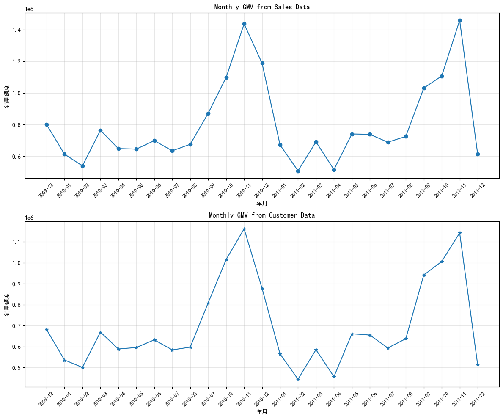
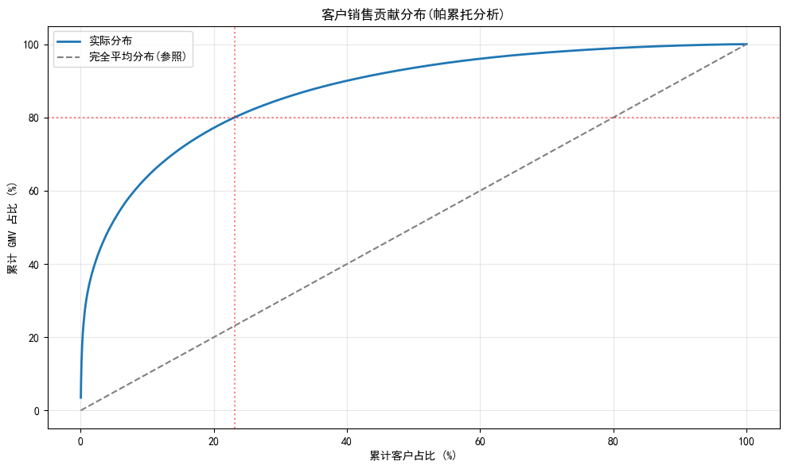
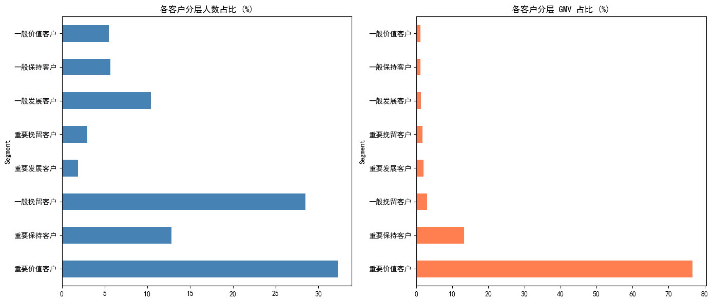

# Online Retail 电商客户价值分析

> 基于 UCI Online Retail II 数据集(2009-2011, 约 107 万条交易记录),
> 完成从数据清洗 → 业务指标 → 客户分层 → SQL 复刻的端到端分析。

## 🎯 核心发现

1. **业务定位**:客单价 **£455**、件均价 **£1.6**,平均每单 280 件 — 这是一家 **B2B 礼品批发商**,不是普通零售
2. **客户黏性**:复购率 **72.4%**(远超零售业 30-50% 平均水平),印证批发业务特性
3. **长尾分布**:**23.1% 的客户贡献了 80% 的 GMV**;头部 32% 客户贡献 **77%** 营收
4. **流失风险**:**12.8%** 的高价值客户(单体平均 £3073)已 271 天未购,**潜在挽回收益 ~£23 万**
5. **市场集中**:UK 市场占总销售额 **86.5%**,业务高度依赖本土

## 📊 关键图表

### 月度销售额趋势:典型节假日效应



**洞察**:2010-11 和 2011-11 各有一个明显尖峰(圣诞礼品季备货),12 月断崖式下跌(礼品已售完)。这不是季节性波动,是 **holiday effect(节假日效应)**。

### 客户价值分布:经典长尾



**洞察**:23.1% 头部客户贡献 80% GMV,呈现强长尾分布,**头部客户对业务至关重要**。

### RFM 客户分层:8 类客户,差异化运营



**洞察**:重要保持客户(12.8%) 已 271 天未活跃但单体价值 £3073,是**挽回价值最高**的群体。

## 📁 项目结构

```
online-retail-analysis/
├── notebooks/
│   ├── 01_eda.ipynb                       # 数据探索:质量诊断、字段含义识别
│   ├── 02_cleaning_and_metrics.ipynb     # 清洗 + 业务指标(GMV、客单价、复购、帕累托)
│   └── 03_rfm_segmentation.ipynb         # RFM 三维客户分层 + 运营建议
├── sql/
│   └── online_retail_analysis.sql        # 9 个核心 SQL 查询(MySQL 8.0+)
├── scripts/
│   └── import_to_mysql.py                # 数据导入到 MySQL 的脚本
├── data/
│   └── README.md                          # 数据来源与字段说明
├── images/                                # README 引用的图表
├── requirements.txt                       # Python 依赖
└── README.md                              # 本文件
```

## 🛠 技术栈

- **数据处理**:Python 3.x、pandas、NumPy
- **可视化**:matplotlib、seaborn
- **数据库**:MySQL 9.x(CTE、窗口函数 `SUM/ROW_NUMBER OVER`、条件聚合 `SUM(IF)`)
- **环境**:PyCharm + Jupyter Notebook

## 🔍 数据处理亮点

**1. 双数据集策略**

清洗后产出两份数据:
- `data_sales`(104 万行):**销售口径**,包含全部真实交易(含游客订单)
- `data_customer`(80 万行):**客户口径**,剔除 CustomerID 缺失的行

**为什么分开**:计算 GMV 等销售指标用全量数据,计算客户分析(RFM、复购)用客户子集。这样避免了"分子分母口径不一致"导致的常见误差。

**2. 三层清洗策略**

- **L1 显式异常过滤**:剔除 C 开头取消单、非数字 StockCode(POST/M/D 等非商品)、Quantity ≤ 0、Price ≤ 0
- **L2 语义异常过滤**:Description 含 `damage` / `lost` / `missing` 等关键词的库存调整记录
- **L3 极值过滤**:Quantity > 10000、Price > 5000 的离群点

**3. 异常的"保留与剔除"原则**

不追求"零异常",而是**清洗到不影响主要结论的程度**。统计分析中使用中位数等稳健指标,自动抵消边界异常。

## 💡 SQL 技术展示

完整查询见 `sql/online_retail_analysis.sql`,涵盖:

- **基础聚合**:Top 商品 / 国家 / GMV 排行
- **日期函数**:`DATE_FORMAT` + `GROUP BY` 月度趋势
- **CTE + JOIN**:多表口径分开计算后合并的月度指标
- **窗口函数**:`SUM(M) OVER (ORDER BY M DESC)` 累计求和实现帕累托分析
- **条件聚合**:`SUM(IF(...))` 在单次扫表中算多个细分指标
- **多层 CTE**:3 层嵌套实现 RFM 分层(原始数据 → 打分 → 标签映射)

## 🚀 如何复现

```bash
# 1. 克隆项目
git clone git@github.com:frozen-s-e-a/online-retail-analysis.git
cd online-retail-analysis

# 2. 安装依赖
pip install -r requirements.txt

# 3. 下载数据
# 从 https://archive.ics.uci.edu/dataset/502/online+retail+ii 下载
# 把 csv 放到 data/online_retail.csv

# 4. 依次运行 notebooks
jupyter notebook
# 按顺序运行 01 → 02 → 03

# 5. (可选)运行 SQL
# 编辑 scripts/import_to_mysql.py 改成你的数据库连接
python scripts/import_to_mysql.py
# 然后在 MySQL 客户端运行 sql/online_retail_analysis.sql
```

## 💼 业务建议(节选)

| 客户分层 | 占比 | GMV 贡献 | 建议策略 |
|---------|------|---------|---------|
| 重要价值客户 | 32.3% | 76.6% | VIP 专属服务、高端新品推荐、生日礼遇 |
| **重要保持客户** | **12.8%** | **13.2%** | **🚨 流失风险最大,人均 £3073。建议每人预算 £20-50 专属优惠券,挽回率 10% 即可回收 £23 万** |
| 一般挽留客户 | 28.5% | 3.0% | 自动化 EDM 唤醒,人力投入有限 |

## 📚 数据来源

UCI Machine Learning Repository: [Online Retail II Dataset](https://archive.ics.uci.edu/dataset/502/online+retail+ii)

## 📝 关于作者

数据分析学习者,正在求职数据分析师岗位。

如有问题或建议,欢迎提 Issue 或 Star ⭐